# New metrics and search algorithms for weighted causal DAGs

This is the accompanying repository the "New metrics and search algorithms for weighted causal DAGs" paper. It is available at https://arxiv.org/pdf/2305.04445.pdf.

Our experiments follow the setup of https://github.com/csquires/dct-policy (the accompanying repository of [SMG+20]) and https://github.com/cxjdavin/subset-verification-and-search-algorithms-for-causal-DAGs (the accompanying repository of [CSB22]).

We have included a copy of the produced `figures` sub-directory in here so you may look at the output without running the experiments yourself.

## Experimental details

Motivated by Theorem 7 of [CS23], we experimented on synthetic moral DAGs.

### Synthetic graph classes

The synthetic graphs are random connected moral DAGs of [SMG+20]. See Section 5 of [SMG+20] for details.

1. Erdős-Rényi styled graphs  
These graphs are parameterized by 2 parameters: $n$ and density $\rho$. Generate a random ordering $\sigma$ over $n$ vertices. Then, set the in-degree of the $n^{th}$ vertex (i.e. last vertex in the ordering) in the order to be $X_n = \max\\{1, \texttt{Binomial}(n-1, \rho)\\}$, and sample $X_n$ parents uniformly form the nodes earlier in the ordering. Finally, chordalize the graph by running the elimination algorithm of [KF09] with elimination ordering equal to the reverse of $\sigma$.

2. Tree-like graphs  
These graphs are parameterized by 4 parameters: $n$, degree $d$, $e_{\min}$, and $e_{\max}$. First, generate a complete directed $d$-ary tree on $n$ nodes. Then, add $\texttt{Uniform}(e_{\min}, e_{\max})$ edges to the tree. Finally, compute a topological order of the graph by DFS and triangulate the graph using that order.

### Weights and generalized cost parameters

We ran experiments for $\alpha \in \\{0,1\\}$ and $\beta = 1$ on two different types of weight classes for a graph on $n$ vertices:

1. Type 1  
The weight of each vertex is independently sampled from an exponential distribution $\exp(n^2)$ with parameter $n^2$. This is to simulate the setting where there is a spread in the costs of the vertices.

2. Type 2  
A randomly chosen $p=0.1$ fraction of vertices are assigned weight $n^2$ while the others are assigned weight $1$. This is to simulate the setting where there are a few randomly chosen high cost vertices.

### Experiments

We have 4 sets of experiments in total (weight type $\in \\{1, 2\\}$; $\alpha \in \\{0,1\\}$), where each set follows the 5 experiments performed in [CSB22].

1. Experiment 1:  
Graph class 1 with $n \in \\{10, 15, 20, 25\\}$ and density $\rho = 0.1$.

2. Experiment 2:  
Graph class 1 with $n \in \\{8, 10, 12, 14\\}$ and density $\rho = 0.1$.

3. Experiment 3:  
Graph class 2 with $n \in \\{100, 200, 300, 400, 500\\}$ and $(\text{degree}, e_{\min}, e_{\max}) = (4, 2, 5)$.

4. Experiment 4:  
Graph class 1 with $n \in \\{10, 15, 20, 25\\}$ and density $\rho = 0.1$.

5. Experiment 5:  
Graph class 2 with $n \in \\{100, 200, 300, 400, 500\\}$ and $(\text{degree}, e_{\min}, e_{\max}) = (40, 20, 50)$.

### Algorithms benchmarked

The following algorithms perform *atomic interventions*.
Our algorithm `weighted_separator` perform atomic interventions when given $k=1$ and *bounded size interventions* when given $k > 1$.

- `random`: A baseline algorithm that repeatedly picks a random non-dominated node (a node that is incident to some unoriented edge) from the interventional essential graph

- `dct`: `DCT Policy` of [SMG+20]

- `coloring`: `Coloring` of [SKD+15]

- `opt_single`: `OptSingle` of [HB14]

- `greedy_minmax`: `MinmaxMEC` of [HG08]

- `greedy_entropy`: `MinmaxEntropy` of [HG08]

- `separator`: Algorithm of [CSB22]. It takes in a parameter $k$ to serve as an upper bound on the number of vertices to use in an intervention.

- `weighted_separator`: Our Algorithm 3. It takes in a parameter $k$ to serve as an upper bound on the number of vertices to use in an intervention.

### Qualitative discussion of experimental results

For any intervention set $\mathcal{I} \subseteq 2^V$ that fully orients the given causal graph, the Y-axis measures the generalized cost $\alpha \cdot w(\mathcal{I}) + \beta \cdot |\mathcal{I}|$. So, fixing either $\alpha$ or $\beta$, and scaling the other will recover any possible observable trend (ignoring the magnitude of the values on the Y-axis). As our experiments were for atomic interventions, the parameter setting of $(\alpha, \beta) = (0,1)$ precisely recovers the unweighted atomic intervention setting.

When $\alpha = 0$, the generalized cost function is simply the number of interventions used that the other state-of-the-art methods were designed for. Here, `weighted_separator` incurs a similar cost despite having additional overheads to ensure theoretical guarantees for general $\alpha \geq 0$.

For $\alpha > 0$, the generalized cost function is affected by the vertex weights, and `weighted_separator` incurs noticeably less generalized cost than the others already when $\alpha = 1$. This gap will only increase as we increase the value of $\alpha$ to make the generalized cost put more weightage on the total additive vertex cost of the intervention $\mathcal{I}$.

As our experimental instances were randomly generated, it does look like existing algorithms, such as `separator`, is competitive with our weight-sensitive algorithm `weighted_separator` on such random instances, even though they are oblivious to vertex weights. However, we can easily create many instances where these algorithms performs arbitrarily worse. For instance, consider the star graph $G^\*$ on $n$ nodes where the leaves have weight 1 and the centroid has weight $w \gg n$; imagine $w = n^{10000}$.
On $G^\*$, `separator` will intervene on the centroid, incurring $w$ while `weighted_separator` will never intervene on the centroid and in the worst case intervene on all the leaves (paying at most $n-1$) to fully orient $G^\*$ from $\mathcal{E}(G^\*)$.

In terms of running time, `weighted_separator` has a similar running time as the other state-of-the-art algorithms across all experiments. To be precise, `weighted_separator` is faster than all benchmarked algorithms except `separator`. This is expected as both are based on 1/2-clique separators but `weighted_separator` has additional computational overheads to handle dangling components.

We also tested the bounded size implementation for $k \in \\{1,3,5\\}$ and observe that the lines "flip", for both weight types. When $(\alpha, \beta) = (0,1)$, $k = 1$ is worst and $k = 3$ is best.  When $(\alpha, \beta) = (1,1)$, $k = 3$ is worst and $k = 1$ is best. This matches what we expect from our theoretical analyses.

## All experimental plots

### Experiment 1 (Type 1 weight, $\alpha = 0$, $\beta = 1$)

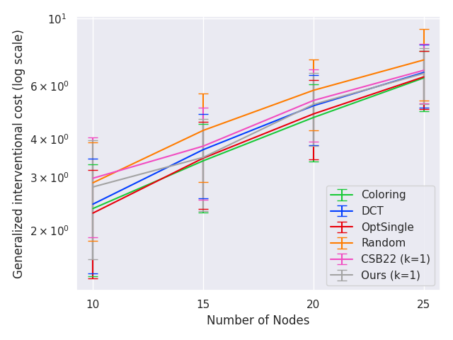
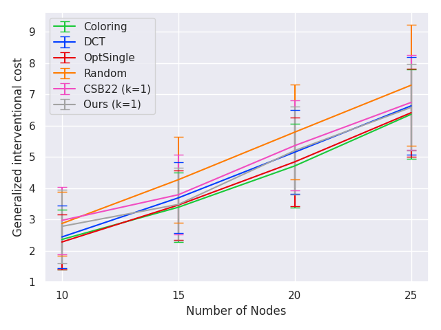

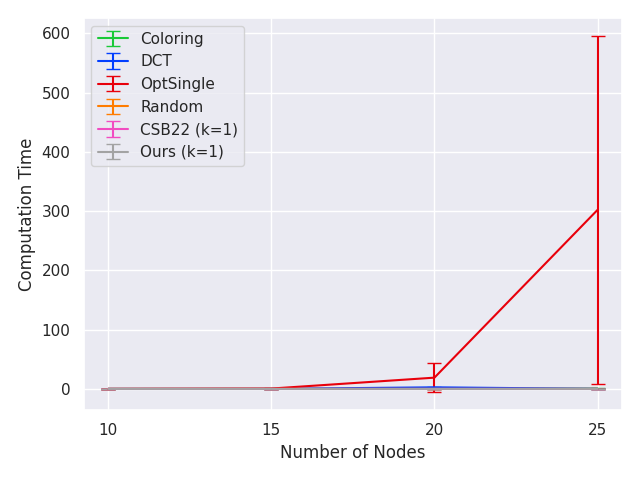

### Experiment 1 (Type 1 weight, $\alpha = 1$, $\beta = 1$)

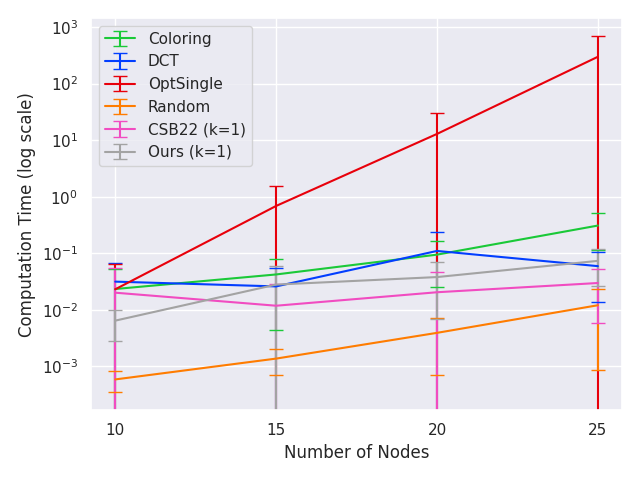

### Experiment 1 (Type 2 weight, $\alpha = 0$, $\beta = 1$)

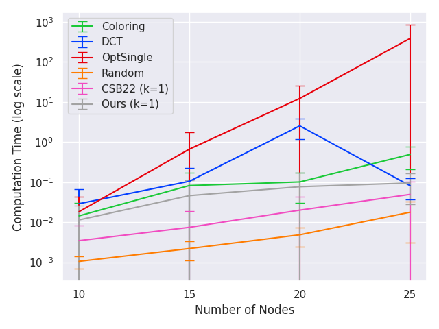

### Experiment 1 (Type 2 weight, $\alpha = 1$, $\beta = 1$)

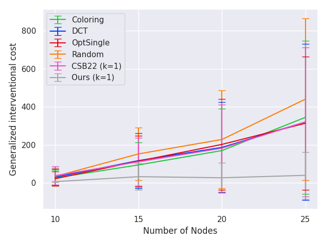
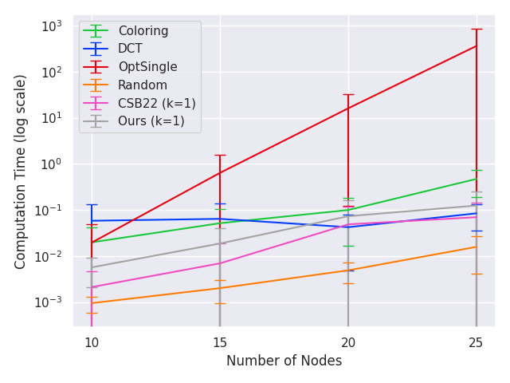

### Experiment 2 (Type 1 weight, $\alpha = 0$, $\beta = 1$)

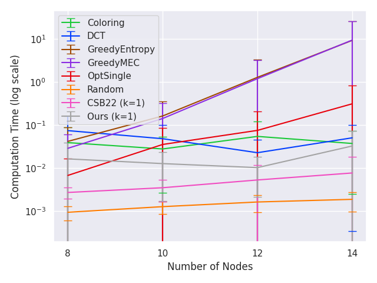

### Experiment 2 (Type 1 weight, $\alpha = 1$, $\beta = 1$)

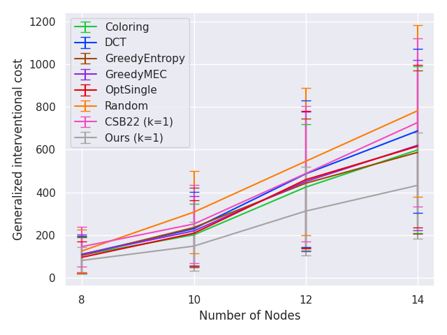

### Experiment 2 (Type 2 weight, $\alpha = 0$, $\beta = 1$)

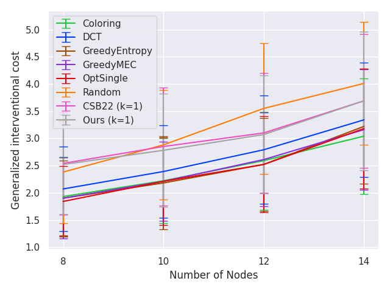

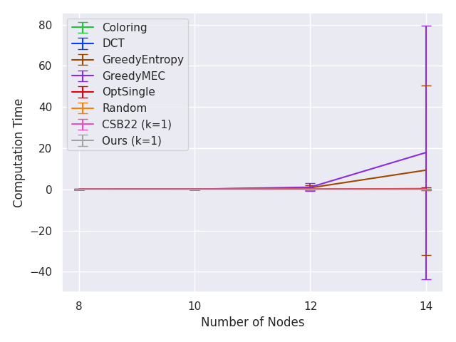

### Experiment 2 (Type 2 weight, $\alpha = 1$, $\beta = 1$)

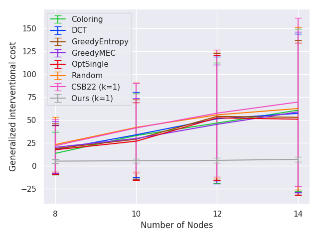
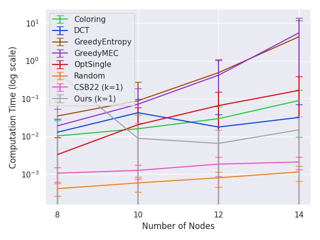

### Experiment 3 (Type 1 weight, $\alpha = 0$, $\beta = 1$)

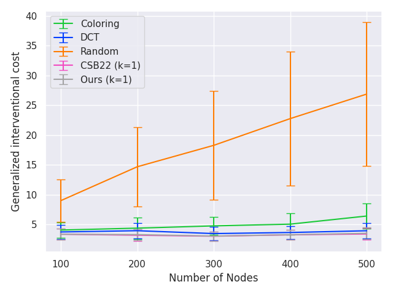

### Experiment 3 (Type 1 weight, $\alpha = 1$, $\beta = 1$)

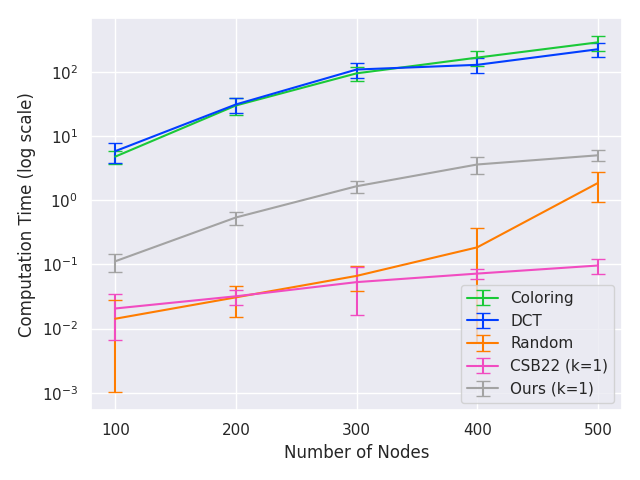
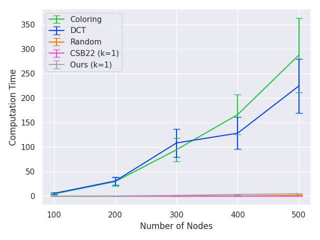

### Experiment 3 (Type 2 weight, $\alpha = 0$, $\beta = 1$)

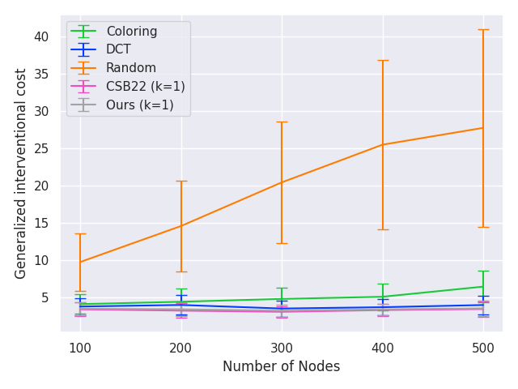
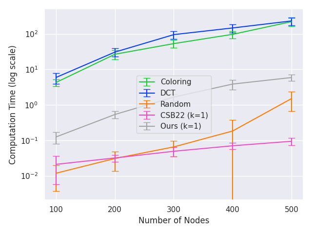
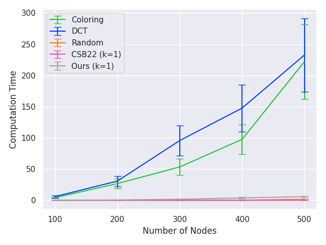

### Experiment 3 (Type 2 weight, $\alpha = 1$, $\beta = 1$)

### Experiment 4 (Type 1 weight, $\alpha = 0$, $\beta = 1$)

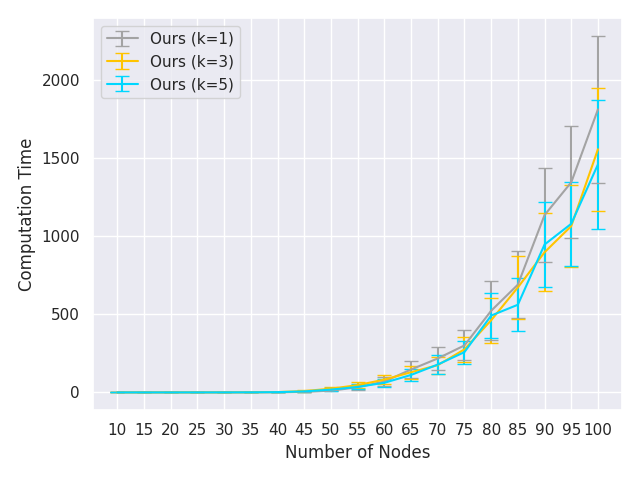

### Experiment 4 (Type 1 weight, $\alpha = 1$, $\beta = 1$)

### Experiment 4 (Type 2 weight, $\alpha = 0$, $\beta = 1$)

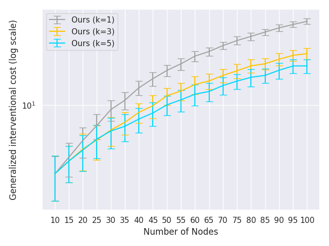

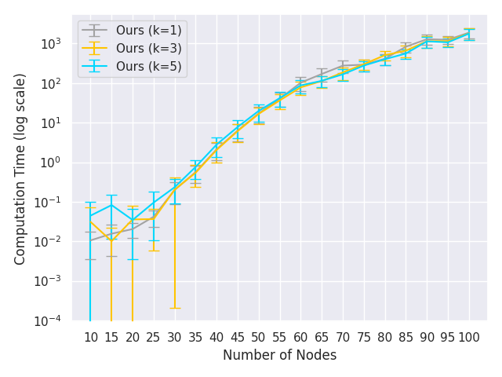

### Experiment 4 (Type 2 weight, $\alpha = 1$, $\beta = 1$)

### Experiment 5 (Type 1 weight, $\alpha = 0$, $\beta = 1$)

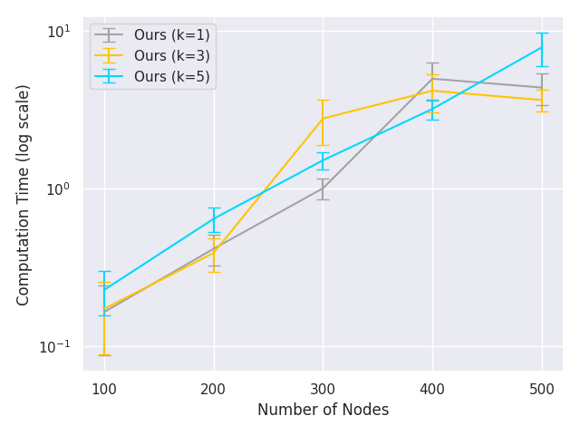
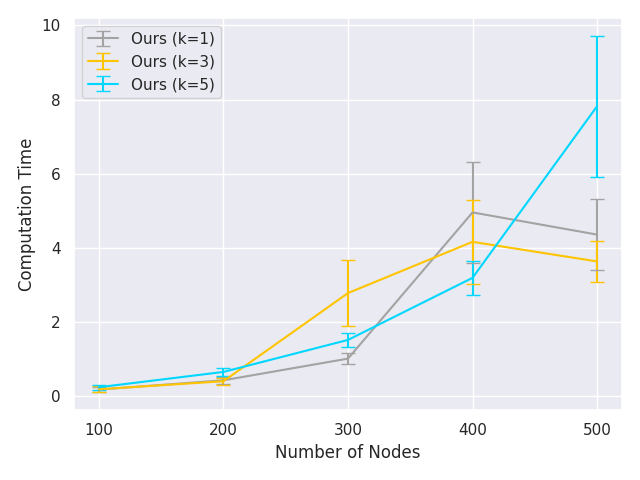

### Experiment 5 (Type 1 weight, $\alpha = 1$, $\beta = 1$)

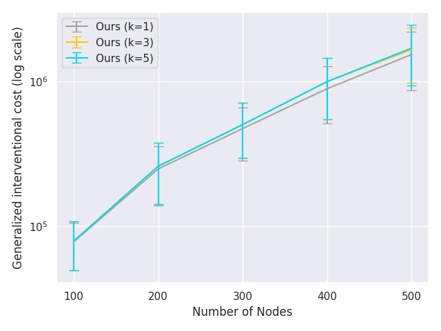

### Experiment 5 (Type 2 weight, $\alpha = 0$, $\beta = 1$)

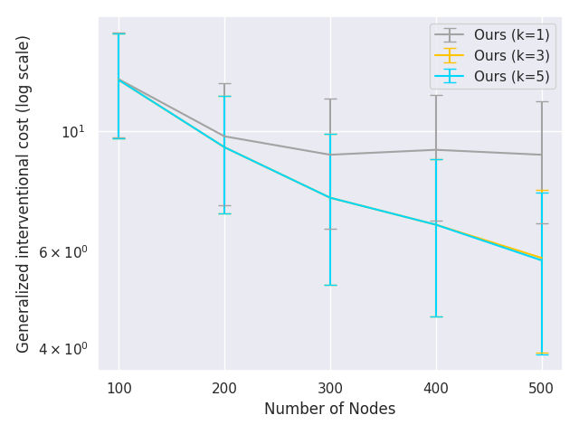
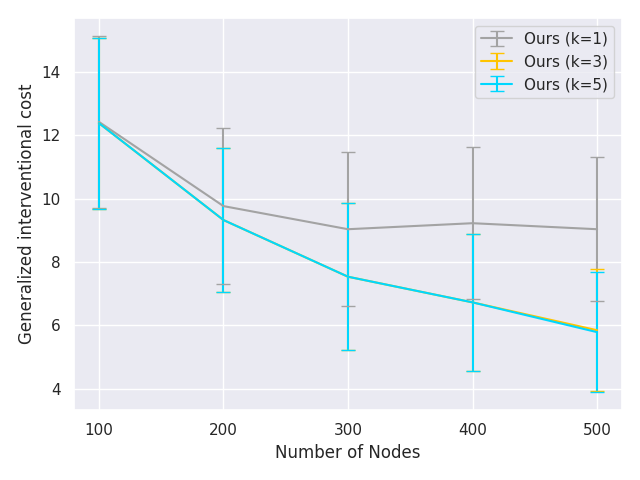

### Experiment 5 (Type 2 weight, $\alpha = 1$, $\beta = 1$)

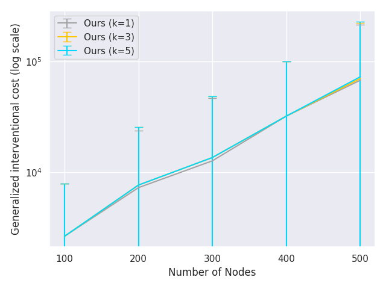

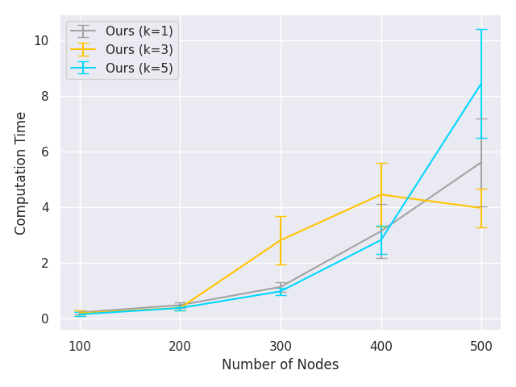

## References

[This paper] Davin Choo, Kirankumar Shiragur. New metrics and search algorithms for weighted causal DAGs. International Conference on Machine Learning, 2023. Available at https://arxiv.org/pdf/2305.04445.pdf

[GRE84] John R. Gilbert, Donald J. Rose, and Anders Edenbrandt. A Separator Theorem for Chordal Graphs. SIAM Journal on Algebraic Discrete Methods, 1984. Available at: https://epubs.siam.org/doi/abs/10.1137/0605032

[HG08] Yang-Bo He and Zhi Geng. Active Learning of Causal Networks with Intervention Experiments and Optimal Designs. Journal of Machine Learning Research, 2008. Available at: https://www.jmlr.org/papers/volume9/he08a/he08a.pdf

[KF09] Daphne Koller and Nir Friedman. Probabilistic graphical models: principles and techniques. MIT press, 2009. Available at: https://mitpress.mit.edu/9780262013192/probabilistic-graphical-models

[HB14] Alain Hauser and Peter Bühlmann. Two Optimal Strategies for Active Learning of Causal Models From Interventional Data. International Journal of Approximate Reasoning, 2014. Available at: https://arxiv.org/pdf/1205.4174.pdf

[SKD+15] Karthikeyan Shanmugam, Murat Kocaoglu, Alexandros G. Dimakis, and Sriram Vishwanath. Learning causal graphs with small interventions. Advances in Neural Information Processing Systems, 2015. Available at: https://arxiv.org/pdf/1511.00041.pdf

[SMG+20] Chandler Squires, Sara Magliacane, Kristjan Greenewald, Dmitriy Katz, Murat Kocaoglu, and Karthikeyan Shanmugam. Active Structure Learning of Causal DAGs via Directed Clique Trees. Advances in Neural Information Processing Systems, 2020. Available at: https://arxiv.org/pdf/2011.00641.pdf

[CSB22] Davin Choo, Kirankumar Shiragur, and Arnab Bhattacharyya. Verification and search algorithms for causal DAGs. Advances in Neural Information Processing Systems, 2022. Available at https://arxiv.org/pdf/2206.15374.pdf
